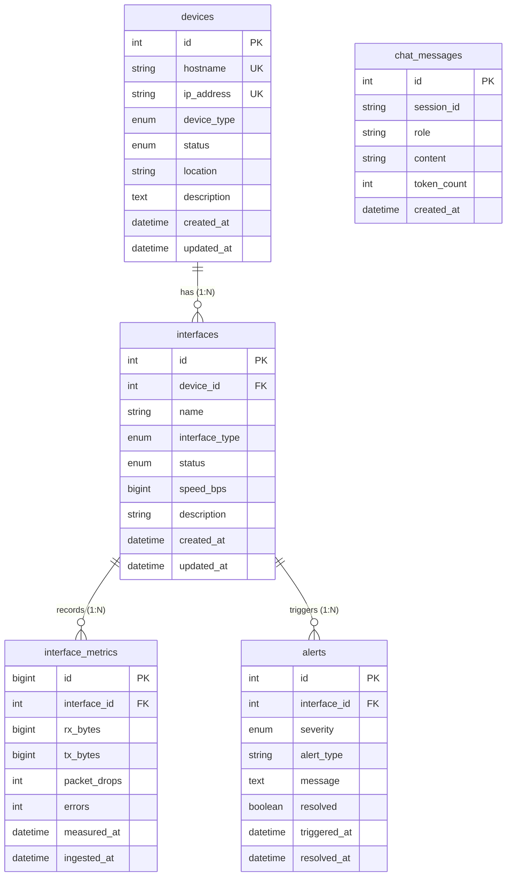

# `database/` — Canonical Database Layer: Complete Schema & Architecture Explanation

> **Audience:** A developer, database administrator (DBA), or backend engineer working on NetOps.  
> **Goal:** After reading this document, you will understand *every file in `database/`*, the *purpose and structure of all 5 database tables*, *indexing strategies*, *foreign key relationships*, *seed data alignment*, and *how database migrations are managed*.

---

## 0. Executive Summary & Purpose

The `database/` directory is the **single source of truth** for the relational data architecture of NetOps. It defines the MySQL 8.0 schema, version-controlled SQL migrations, and baseline seed data for network topology.

```
                                  ┌──────────────────────────┐
                                  │   database/schema/       │
                                  │       schema.sql         │
                                  │ (Canonical DDL Baseline) │
                                  └─────────────┬────────────┘
                                                │
                 ┌──────────────────────────────┴──────────────────────────────┐
                 ▼                                                             ▼
  ┌─────────────────────────────┐                               ┌─────────────────────────────┐
  │    database/migrations/     │                               │      database/seeds/        │
  │      alembic_init.sql       │                               │      seed_topology.sql      │
  │  0001_initial_schema.sql    │                               │  (Deterministic Topology    │
  │ (Alembic DDL Migrations)    │                               │   matching Simulator spec)  │
  └──────────────┬──────────────┘                               └──────────────┬──────────────┘
                 │                                                             │
                 ▼                                                             ▼
  ┌───────────────────────────────────────────────────────────────────────────────────────────┐
  │                                   MySQL 8.0 Engine (InnoDB)                               │
  │                                                                                           │
  │    ┌───────────────┐     1:N      ┌──────────────────┐     1:N      ┌──────────────────┐  │
  │    │    devices    ├─────────────►│    interfaces    ├─────────────►│interface_metrics │  │
  │    └───────────────┘              └─────────┬────────┘              └──────────────────┘  │
  │                                             │ 1:N                                         │
  │                                             ▼                                             │
  │                                   ┌──────────────────┐              ┌──────────────────┐  │
  │                                   │      alerts      │              │  chat_messages   │  │
  │                                   └──────────────────┘              └──────────────────┘  │
  └───────────────────────────────────────────────────────────────────────────────────────────┘
```

### Core Design Principles
1. **Third Normal Form (3NF):**  
   Device properties (hostname, IP address, device type) are separated from interface properties (interface name, speed, interface type). Interface telemetry samples (`interface_metrics`) only reference `interface_id`, preventing redundancy.
2. **Strict Referential Integrity:**  
   Foreign keys link `interfaces -> devices`, `interface_metrics -> interfaces`, and `alerts -> interfaces`. All use `ON DELETE CASCADE ON UPDATE CASCADE` to prevent orphaned rows when devices or interfaces are decommissioned.
3. **High-Throughput Time-Series Optimization:**  
   `interface_metrics` is optimized for continuous telemetry ingestion:
   - Primary key is `BIGINT UNSIGNED` to prevent ID exhaustion under sustained multi-million sample writes.
   - Composite index `(interface_id, measured_at DESC)` allows single-seek range scans for graphing queries like *"show Gi0/0 bandwidth for the last 15 minutes"*.
4. **Deterministic Seed Alignment:**  
   The primary keys generated in `seed_topology.sql` match the blueprint hostnames and interface names in `simulator/app/topology/blueprint.py` exactly, ensuring flawless zero-configuration startup.

---

## 1. Directory Tree & File Inventory

```
database/
├── schema/
│   └── schema.sql                          # Canonical, full database schema definition
├── migrations/
│   ├── alembic_init.sql                    # One-time bootstrap table for Alembic tracking
│   └── versions/
│       └── 0001_initial_schema.sql         # First tracked migration DDL (matches schema.sql)
├── seeds/
│   └── seed_topology.sql                   # Realistic demo topology (6 devices, 14 interfaces)
├── README.md                               # Operational quick-start for DB resets and migrations
└── explanation.md                          # ← This document
```

---

## 2. In-Depth Walkthrough of Every Single File

### 2.1 Canonical Schema (`database/schema/schema.sql`)

This file is the authoritative definition of the complete schema. It is intended for:
- Initial database creation during local development or test suite provisioning.
- Reference baseline for DBAs and architects to audit table structures, indexes, and constraints.
- Resetting a database to a clean slate via:
  ```bash
  mysql -u netops -p netops < database/schema/schema.sql
  ```

#### Global Settings Defined:
- `SET NAMES utf8mb4;`: Guarantees full Unicode character support (including emojis and multilingual network device descriptions).
- `SET time_zone = '+00:00';`: Enforces UTC at the session level to eliminate daylight saving ambiguities.
- Storage engine: `ENGINE=InnoDB` for all tables, guaranteeing ACID compliance and foreign key enforcement.
- Collation: `utf8mb4_unicode_ci` for accurate case-insensitive collation and international character matching.

---

### 2.2 Migrations (`database/migrations/`)

#### `database/migrations/alembic_init.sql`
Creates the tracking table used by Alembic:
```sql
CREATE TABLE IF NOT EXISTS alembic_version (
    version_num VARCHAR(32) NOT NULL,
    CONSTRAINT alembic_version_pkc PRIMARY KEY (version_num)
) ENGINE=InnoDB DEFAULT CHARSET=utf8mb4 COLLATE=utf8mb4_unicode_ci;
```
When running Alembic migrations from `backend/alembic/`, Alembic queries this table to determine the currently applied migration revision.

#### `database/migrations/versions/0001_initial_schema.sql`
The SQL equivalent of revision `0001`. It creates the five core tables (`devices`, `interfaces`, `interface_metrics`, `alerts`, `chat_messages`). In production CI/CD pipelines, changes to the database are never applied using raw `schema.sql` resets; instead, numbered migration files in `database/migrations/versions/` and corresponding Python scripts in `backend/alembic/versions/` are rolled out incrementally using `alembic upgrade head`.

---

### 2.3 Seed Data (`database/seeds/seed_topology.sql`)

Seeds the database with a believable corporate network topology matching `simulator/app/topology/blueprint.py`.

#### Execution Safety:
```sql
SET FOREIGN_KEY_CHECKS = 0;
TRUNCATE TABLE interface_metrics;
TRUNCATE TABLE alerts;
TRUNCATE TABLE interfaces;
TRUNCATE TABLE devices;
SET FOREIGN_KEY_CHECKS = 1;
```
Disables foreign key checks during truncation so tables can be cleared in any order without foreign key constraint violations, then immediately re-enables them.

#### Deterministic ID Scheme:
- **Devices:** Sequential IDs `1` through `6`.
- **Interfaces:** Structured as `(device_id * 10) + local_index`:
  - Device 1 (`R1`): IDs `10` (`Gi0/0`), `11` (`Gi0/1`), `12` (`Lo0`)
  - Device 2 (`R2`): IDs `20` (`Gi0/0`), `21` (`Gi0/1`), `22` (`Lo0`)
  - Device 3 (`CORE-SW1`): IDs `30` (`Gi1/0/1`), `31` (`Gi1/0/2`), `32` (`Gi1/0/3`), `33` (`Vlan10`)
  - Device 4 (`CORE-SW2`): IDs `40` (`Gi1/0/1`), `41` (`Gi1/0/2`), `42` (`Vlan20`)
  - Device 5 (`FW1`): IDs `50` (`eth0`), `51` (`eth1`)
  - Device 6 (`AP1`): IDs `60` (`eth0`), `61` (`wlan0`), `62` (`wlan1`)

This deterministic numbering ensures that developers can easily write manual queries during viva demonstrations or debugging without looking up auto-generated random IDs.

---

## 3. Comprehensive Table-by-Table Deep Dive

### 3.1 Table: `devices`

Represents physical or virtual network appliances monitored by the NOC platform.

```sql
CREATE TABLE IF NOT EXISTS devices (
    id            INT UNSIGNED    NOT NULL AUTO_INCREMENT,
    hostname      VARCHAR(128)    NOT NULL,
    ip_address    VARCHAR(45)     NOT NULL,   -- supports IPv6
    device_type   ENUM('router','switch','firewall','loadbalancer','access_point','other')
                  NOT NULL DEFAULT 'other',
    status        ENUM('UP','DOWN','WARNING','CRITICAL','MAINTENANCE','UNKNOWN')
                  NOT NULL DEFAULT 'UNKNOWN',
    location      VARCHAR(256)    DEFAULT NULL,
    description   TEXT            DEFAULT NULL,
    created_at    DATETIME(6)     NOT NULL DEFAULT CURRENT_TIMESTAMP(6),
    updated_at    DATETIME(6)     NOT NULL DEFAULT CURRENT_TIMESTAMP(6)
                  ON UPDATE CURRENT_TIMESTAMP(6),

    PRIMARY KEY (id),
    UNIQUE  KEY uq_devices_hostname   (hostname),
    UNIQUE  KEY uq_devices_ip_address (ip_address),
    INDEX   idx_devices_status        (status),
    INDEX   idx_devices_type          (device_type)
) ENGINE=InnoDB DEFAULT CHARSET=utf8mb4 COLLATE=utf8mb4_unicode_ci;
```

#### Field Explanations:
- `id`: Primary key (`INT UNSIGNED`), supporting over 4.29 billion unique devices.
- `hostname`: Fully qualified domain name or network hostname (e.g. `R1`, `CORE-SW1`). Enforced unique via `uq_devices_hostname`.
- `ip_address`: Management IPv4 or IPv6 address. Sized at `VARCHAR(45)` to accommodate maximum IPv6 textual representations (e.g. `2001:0db8:85a3:0000:0000:8a2e:0370:7334`). Enforced unique via `uq_devices_ip_address`.
- `device_type`: Enumerated string field restricting devices to known network categories.
- `status`: Device health status. Used by dashboard health summary widgets.
- `location`: Optional physical datacenter, rack, or floor location (e.g. `"DC1 Rack 4A"`).
- `created_at` / `updated_at`: Microsecond-precision (`DATETIME(6)`) audit timestamps. `updated_at` automatically updates on any row modification via `ON UPDATE CURRENT_TIMESTAMP(6)`.

#### Indexing Strategy:
- `uq_devices_hostname`: Ensures hostname uniqueness and enables $O(1)$ lookups when resolving simulator blueprints.
- `uq_devices_ip_address`: Guarantees that management IP addresses are unique across the inventory.
- `idx_devices_status`: Accelerates NOC filtering queries (e.g. `SELECT * FROM devices WHERE status = 'CRITICAL'`).
- `idx_devices_type`: Accelerates category queries (e.g. `SELECT * FROM devices WHERE device_type = 'router'`).

---

### 3.2 Table: `interfaces`

Represents physical ports, logical sub-interfaces, VLANs, and loopbacks residing on a device.

```sql
CREATE TABLE IF NOT EXISTS interfaces (
    id                  INT UNSIGNED    NOT NULL AUTO_INCREMENT,
    device_id           INT UNSIGNED    NOT NULL,
    name                VARCHAR(64)     NOT NULL,   -- e.g. "GigabitEthernet0/1"
    interface_type      ENUM('ethernet','loopback','vlan','tunnel','other')
                        NOT NULL DEFAULT 'ethernet',
    status              ENUM('UP','DOWN','ADMIN_DOWN','ERROR','UNKNOWN')
                        NOT NULL DEFAULT 'UNKNOWN',
    speed_bps           BIGINT UNSIGNED DEFAULT NULL,   -- link capacity
    description         VARCHAR(256)    DEFAULT NULL,
    created_at          DATETIME(6)     NOT NULL DEFAULT CURRENT_TIMESTAMP(6),
    updated_at          DATETIME(6)     NOT NULL DEFAULT CURRENT_TIMESTAMP(6)
                        ON UPDATE CURRENT_TIMESTAMP(6),

    PRIMARY KEY (id),
    UNIQUE  KEY uq_interfaces_device_name (device_id, name),
    INDEX   idx_interfaces_device_id      (device_id),
    INDEX   idx_interfaces_status         (status),
    CONSTRAINT fk_interfaces_device
        FOREIGN KEY (device_id) REFERENCES devices (id)
        ON DELETE CASCADE ON UPDATE CASCADE
) ENGINE=InnoDB DEFAULT CHARSET=utf8mb4 COLLATE=utf8mb4_unicode_ci;
```

#### Field Explanations:
- `id`: Unique interface ID (`INT UNSIGNED`).
- `device_id`: Foreign key referencing `devices(id)`.
- `name`: Interface identifier (e.g. `Gi0/0`, `Vlan10`, `Lo0`).
- `interface_type`: Port type classifier.
- `status`: Current interface operational state.
- `speed_bps`: Nominal line speed in bits per second (e.g. `10000000000` for 10 Gbps, `1000000000` for 1 Gbps). Stored as `BIGINT UNSIGNED` to comfortably represent multi-terabit links without integer overflow.
- `uq_interfaces_device_name`: Compound unique constraint on `(device_id, name)`. While different routers can each have a `Gi0/0`, a single device cannot have duplicate interface names.
- `fk_interfaces_device`: Enforces referential integrity. Deleting a device in `devices` will automatically remove all its associated interfaces and downstream metrics.

---

### 3.3 Table: `interface_metrics`

The high-volume time-series telemetry repository written by the Collection Layer.

```sql
CREATE TABLE IF NOT EXISTS interface_metrics (
    id              BIGINT UNSIGNED NOT NULL AUTO_INCREMENT,
    interface_id    INT UNSIGNED    NOT NULL,
    rx_bytes        BIGINT UNSIGNED NOT NULL DEFAULT 0,
    tx_bytes        BIGINT UNSIGNED NOT NULL DEFAULT 0,
    packet_drops    INT UNSIGNED    NOT NULL DEFAULT 0,
    errors          INT UNSIGNED    NOT NULL DEFAULT 0,
    measured_at     DATETIME(6)     NOT NULL,
    ingested_at     DATETIME(6)     NOT NULL DEFAULT CURRENT_TIMESTAMP(6),

    PRIMARY KEY (id),
    INDEX idx_metrics_interface_time (interface_id, measured_at DESC),
    INDEX idx_metrics_measured_at    (measured_at DESC),
    CONSTRAINT fk_metrics_interface
        FOREIGN KEY (interface_id) REFERENCES interfaces (id)
        ON DELETE CASCADE ON UPDATE CASCADE
) ENGINE=InnoDB DEFAULT CHARSET=utf8mb4 COLLATE=utf8mb4_unicode_ci;
```

#### Field Explanations:
- `id`: `BIGINT UNSIGNED` primary key, capable of recording up to $1.84 \times 10^{19}$ telemetry records.
- `interface_id`: Foreign key referencing `interfaces(id)`.
- `rx_bytes`: Volume of received bytes during the sampling window.
- `tx_bytes`: Volume of transmitted bytes during the sampling window.
- `packet_drops`: Count of dropped packets detected during the window (buffer overflows, tail-drops).
- `errors`: Count of framing, CRC, or physical layer transmission errors.
- `measured_at`: The precise timestamp recorded by the collection source or router clock when the measurement took place.
- `ingested_at`: Server timestamp when the record was persisted into MySQL.

#### The Crucial Index: `idx_metrics_interface_time`
The composite index `(interface_id, measured_at DESC)` is specifically constructed to optimize the most frequent queries in network monitoring:
```sql
SELECT rx_bytes, tx_bytes, packet_drops, errors, measured_at
FROM interface_metrics
WHERE interface_id = 10
  AND measured_at >= NOW() - INTERVAL 1 HOUR
ORDER BY measured_at DESC;
```
Because the index is prefixed with `interface_id` and ordered by `measured_at DESC`, InnoDB performs a direct B-tree lookup on `interface_id` and retrieves the latest metrics sequentially without needing an expensive temporary table sort (`filesort`).

#### Scalability & Partitioning Strategy:
For large-scale production deployments with millions of rows generated daily, `interface_metrics` can be partitioned by time range:
```sql
PARTITION BY RANGE (TO_DAYS(measured_at)) (
    PARTITION p_2026_10_01 VALUES LESS THAN (TO_DAYS('2026-10-02')),
    PARTITION p_2026_10_02 VALUES LESS THAN (TO_DAYS('2026-10-03')),
    ...
);
```
Partitioning makes purging data older than 30 or 90 days virtually instantaneous via `ALTER TABLE interface_metrics DROP PARTITION p_...`, avoiding heavy `DELETE` statements that generate massive undo logs.

---

### 3.4 Table: `alerts`

Records network anomalies, threshold violations, and AI-detected faults.

```sql
CREATE TABLE IF NOT EXISTS alerts (
    id              INT UNSIGNED    NOT NULL AUTO_INCREMENT,
    interface_id    INT UNSIGNED    NOT NULL,
    severity        ENUM('LOW','MEDIUM','HIGH','CRITICAL')
                    NOT NULL DEFAULT 'LOW',
    alert_type      VARCHAR(64)     NOT NULL,   -- e.g. "high_drop_rate"
    message         TEXT            NOT NULL,
    resolved        TINYINT(1)      NOT NULL DEFAULT 0,
    triggered_at    DATETIME(6)     NOT NULL DEFAULT CURRENT_TIMESTAMP(6),
    resolved_at     DATETIME(6)     DEFAULT NULL,

    PRIMARY KEY (id),
    INDEX idx_alerts_interface   (interface_id),
    INDEX idx_alerts_severity    (severity),
    INDEX idx_alerts_resolved    (resolved),
    INDEX idx_alerts_triggered   (triggered_at DESC),
    CONSTRAINT fk_alerts_interface
        FOREIGN KEY (interface_id) REFERENCES interfaces (id)
        ON DELETE CASCADE ON UPDATE CASCADE
) ENGINE=InnoDB DEFAULT CHARSET=utf8mb4 COLLATE=utf8mb4_unicode_ci;
```

#### Field Explanations:
- `id`: Unique alert ID.
- `interface_id`: Link to the faulted interface.
- `severity`: Alert priority level (`LOW`, `MEDIUM`, `HIGH`, `CRITICAL`).
- `alert_type`: Standardized code (e.g. `"packet_drop_spike"`, `"interface_down"`, `"crc_errors"`, `"high_utilization"`).
- `message`: Human-readable summary of the condition.
- `resolved`: Boolean flag (`0` = active/firing, `1` = resolved).
- `triggered_at`: Timestamp when the condition was detected.
- `resolved_at`: Timestamp when the condition cleared or was acknowledged.

---

### 3.5 Table: `chat_messages`

Persists dialogue history between network operators and the AI Copilot.

```sql
CREATE TABLE IF NOT EXISTS chat_messages (
    id              INT UNSIGNED    NOT NULL AUTO_INCREMENT,
    session_id      VARCHAR(36)     NOT NULL,   -- UUID
    role            ENUM('user','assistant','system')
                    NOT NULL,
    content         TEXT            NOT NULL,
    token_count     INT UNSIGNED    DEFAULT NULL,
    created_at      DATETIME(6)     NOT NULL DEFAULT CURRENT_TIMESTAMP(6),

    PRIMARY KEY (id),
    INDEX idx_chat_session   (session_id, created_at ASC),
    INDEX idx_chat_created   (created_at DESC)
) ENGINE=InnoDB DEFAULT CHARSET=utf8mb4 COLLATE=utf8mb4_unicode_ci;
```

#### Field Explanations:
- `id`: Message primary key.
- `session_id`: Client session UUID (`VARCHAR(36)`), grouping messages from a user conversation together.
- `role`: Message author (`user`, `assistant`, or `system`).
- `content`: Complete markdown or plain text prompt/response.
- `token_count`: Estimated or reported LLM tokens consumed.
- `idx_chat_session`: Compound index on `(session_id, created_at ASC)` enabling rapid chronological reconstruction of conversation history when grounding the AI Copilot.

---

## 4. Entity-Relationship Diagram (ERD)



---

## 5. Database Operations & Migration Workflow

### 5.1 Local Initialization (Docker)

To spin up a local MySQL instance:
```powershell
docker compose up -d mysql
```

To perform a clean schema load and seed:
```powershell
# Reset schema
Get-Content database/schema/schema.sql | docker exec -i netops-mysql mysql -u netops -pnetops netops

# Load seed topology
Get-Content database/seeds/seed_topology.sql | docker exec -i netops-mysql mysql -u netops -pnetops netops
```

### 5.2 Managing Migrations with Alembic

Alembic migrations are executed from the `backend/` directory:
```powershell
cd backend
.\.venv\Scripts\Activate.ps1

# Apply all pending migrations
alembic upgrade head

# Rollback one migration step
alembic downgrade -1

# Check current revision status
alembic current
```

#### How to Add a New Migration:
1. Create a raw SQL migration script in `database/migrations/versions/0002_<description>.sql`.
2. Generate an Alembic revision file:
   ```powershell
   cd backend
   alembic revision -m "add_table_xyz"
   ```
3. Update the generated Python file in `backend/alembic/versions/` with the appropriate `upgrade()` and `downgrade()` steps.
4. Execute `alembic upgrade head` and verify table presence with `SHOW TABLES;`.
